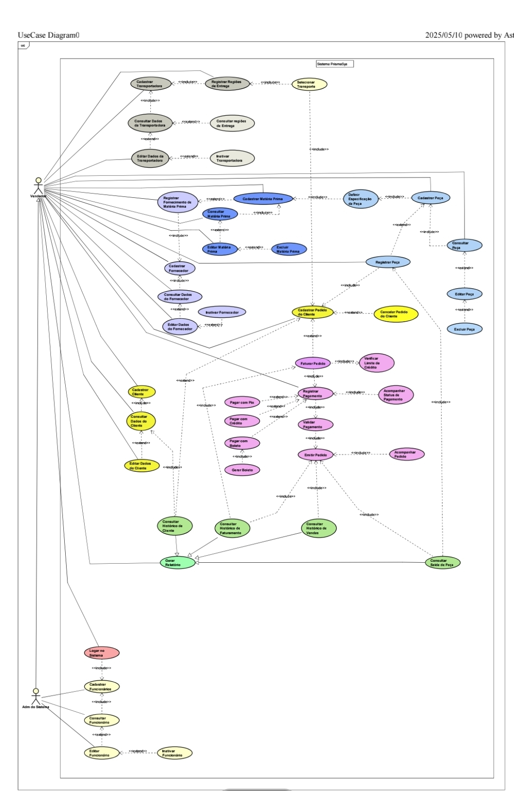
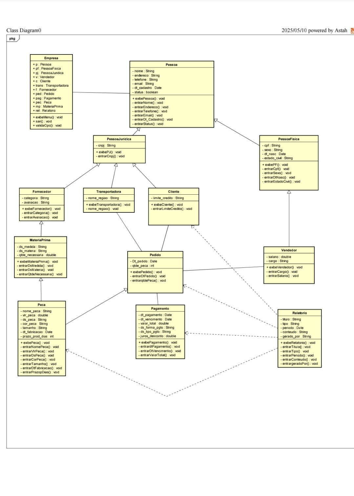

# 🚀 Sistema ERP - Produção, Estoque e Distribuição

Sistema ERP (Enterprise Resource Planning) desenvolvido como projeto acadêmico para automatizar os processos de uma empresa têxtil de pequeno porte localizada em Jandira - SP. O sistema foi construído com **Java**, **Oracle SQL** e **UML**, utilizando práticas modernas de **programação orientada a objetos** e **engenharia de software**.

---

## 🧠 Sobre o Projeto

A empresa enfrentava problemas com uma solução terceirizada: lentidão na comunicação entre setores, perda de dados e falhas na operação. Desenvolvemos um **sistema personalizado** que:

- Automatiza o processo de pedidos
- Seleciona a transportadora ideal por região
- Centraliza cadastros e históricos de clientes, vendas e faturamento
- Armazena e organiza indicadores de desempenho (KPIs)

---

## 🛠️ Tecnologias Utilizadas

- 💻 **Java 21**
- 🗄️ **Oracle Database**
- ⚙️ **NetBeans + Maven**
- 📊 **Modelagem UML (Casos de Uso e Classes)**
- 📘 **Procedures em PL/SQL**
- 📈 **KPIs para análise de performance**

---

## 📌 Funcionalidades

### Requisitos Funcionais
✅ Login e controle de acesso  
✅ Cadastro: transportadora, cliente, fornecedor, produto, funcionário, pedido  
✅ Pagamentos: PIX, crédito, boleto, controle de limite  
✅ Emissão e visualização de pedidos e notas fiscais  
✅ Histórico: vendas, faturamento, clientes  
✅ Relatórios: semanais, mensais, anuais

### Requisitos Não Funcionais
⚡ Eficiência  
🔒 Confiabilidade  
🔄 Integração  
🚀 Agilidade

---

## 📐 Diagramas do Sistema

- Diagrama de Casos de Uso – mapeamento da interação entre usuários e o sistema  
- Diagrama de Classes – estrutura orientada a objetos do sistema

  
  

---

## 💡 Principais Benefícios

- 💬 Redução de erros humanos e retrabalho
- 📦 Melhor organização do estoque e pedidos
- 📲 Acesso facilitado a dados operacionais
- 🤝 Melhoria no relacionamento com o cliente
- 📉 Apoio à tomada de decisão por meio de KPIs

---

## 👨‍💻 Equipe de Desenvolvimento

| Nome                         | Curso  |
|------------------------------|--------|
| Paulo João Dongosse          | ADS    |
| Aline Raissa Alves Gardenal | CCOMP  |
| Gabriel Malheiros Chaves    | CCOMP  |
| Iara Pereira Vasconcelos     | ADS    |
| Maria Luiza dos Santos Silva | CCOMP  |
| Rafael Eduardo de Sousa Vieira | CCOMP |
| Victor Rocha Rodrigues       | CCOMP  |
**Orientadora:** Profª Me. Lúcia Contente Mós

---

## 📁 Estrutura do Projeto (exemplo)

```
empresa/
│   Artigo PI 2.docx
│   diagrama_de_caso_de_uso.jpg
│   diagrama_de_classe.jpg
│   estrutura.txt
│   pom.xml
│
├───SQL tabelas
│       As_procedures.sql
│       As_sequencias.sql
│       Tabelas_do_projeto_PI.sql
│
└───src
    ├───main
    │   └───mycompany
    │       └───empresa
    │               cliente.java
    │               ConexaoOracle.java
    │               Empresa.java
    │               fornecedor.java
    │               funcionario.java
    │               materiaPrima.java
    │               pagamento.java
    │               peca.java
    │               pedido.java
    │               pessoa.java
    │               pessoaJuridica.java
    │               transportadora.java
    │               vendedor.java
    │
    └───test
        └───java
```

---

## 🧪 Como Executar

1. Clone o repositório:
   ```bash
   https://github.com/Paulo-Dongosse/SISTEMA-PARA-PRODU-O-ESTOQUE-E-DISTRIBUI-O.git
   ```

2. Compile o projeto:
   ```bash
   mvn clean package
   ```

3. Execute com o Maven:
   ```bash
   mvn exec:java -Dexec.mainClass="mycompany.empresa.Empresa"
   ```

---

## 🏁 Considerações Finais

Este projeto demonstra a aplicação prática dos conceitos de engenharia de software, banco de dados e programação orientada a objetos para resolver problemas reais de uma empresa. A solução criada contribui diretamente para melhorar a produtividade e a gestão de dados, representando um importante passo na transformação digital da organização.

---

## 📚 Referências

- BOOCH, G; RUMBAUGH, J; JACOBSON, I. *UML Guia do Usuário*  
- NASSU, E. A.; SETZER, V. W. *Banco de Dados Orientados a Objetos*  
- SANTOS, R. *Introdução à Programação Orientada a Objetos Usando Java*
